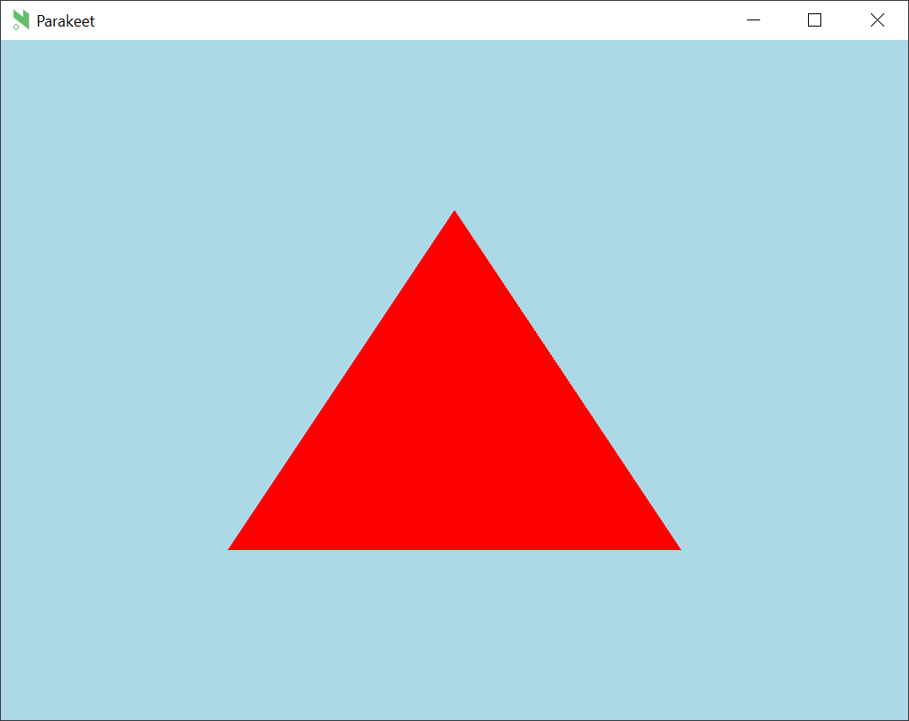
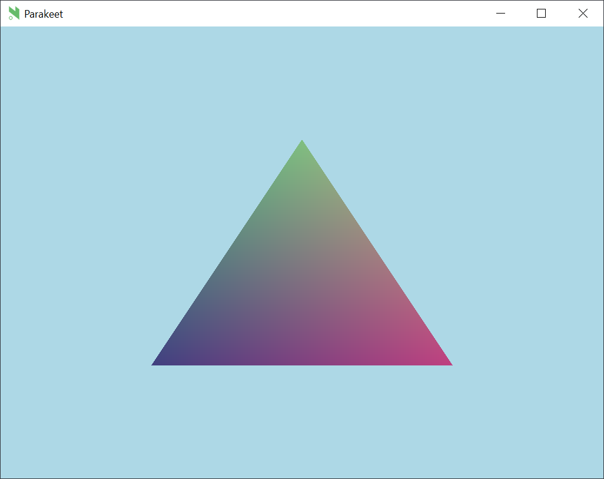

It is important to know that paranim is a relatively thin wrapper over OpenGL. It gives you just enough structure to avoid error-prone boilerplate without losing low-level control. If you want to render *anything* beyond images and simple shapes, you will need to create your own entity.

Entities are objects that contain all the necessary OpenGL state to render something, including shaders and the attributes/uniforms that are passed to them. This tutorial demonstrates how to make a custom entity that renders a triangle.

Some OpenGL/WebGL knowledge would help to understand this. I recommend [WebGL2 Fundamentals](https://webgl2fundamentals.org/) and [Learn OpenGL](https://learnopengl.com/) to learn more.

To begin, clone the [parakeet](https://github.com/paranim/parakeet) starter project and make sure you can run it with `nimble dev`. Then, completely replace `src/core.nim` with the following:

```nim
import paranim/opengl
import paranim/gl, paranim/gl/[uniforms, attributes, entities]
from paranim/glm import nil

type
  Game* = object of RootGame
    deltaTime*: float
    totalTime*: float

var
  windowWidth: int
  windowHeight: int

proc onKeyPress*(key: int) =
  discard

proc onKeyRelease*(key: int) =
  discard

proc onMouseClick*(button: int) =
  discard

proc onMouseMove*(xpos: float, ypos: float) =
  discard

proc onWindowResize*(width: int, height: int, worldWidth: int, worldHeight: int) =
  windowWidth = width
  windowHeight = height

proc init*(game: var Game) =
  doAssert glInit()
  glEnable(GL_BLEND)
  glBlendFunc(GL_SRC_ALPHA, GL_ONE_MINUS_SRC_ALPHA)

proc tick*(game: Game) =
  glClearColor(173/255, 216/255, 230/255, 1f)
  glClear(GL_COLOR_BUFFER_BIT)
  glViewport(0, 0, int32(windowWidth), int32(windowHeight))
```

Now when you run `nimble dev`, it should just show a light blue background.

We'll start by using the built-in `TwoDEntity` to draw a triangle. We'll need to define three sets of (x, y) vertices as a constant. Put this somewhere near the top of `src/core.nim`:

```nim
const
  vertices = [-0.5f, -0.5f,
              0.5f, -0.5f,
              0.0f, 0.5f]
```

Then, define the entity alongside the other mutable variables:

```nim
var
  windowWidth: int
  windowHeight: int
  entity: TwoDEntity
```

In your `init` proc, call `initTwoDEntity` with the `vertices`. This will return an uncompiled entity, meaning that it isn't ready to render yet. Set its color to red and then `compile` it to create the `entity`:

```nim
proc init*(game: var Game) =
  doAssert glInit()
  glEnable(GL_BLEND)
  glBlendFunc(GL_SRC_ALPHA, GL_ONE_MINUS_SRC_ALPHA)
  var uncompiledEntity = initTwoDEntity(vertices)
  uncompiledEntity.color(glm.vec4(1f, 0f, 0f, 1f))
  entity = compile(game, uncompiledEntity)
```

Lastly, simple `render` it in the `tick` proc:

```nim
proc tick*(game: Game) =
  glClearColor(173/255, 216/255, 230/255, 1f)
  glClear(GL_COLOR_BUFFER_BIT)
  glViewport(0, 0, int32(windowWidth), int32(windowHeight))
  render(game, entity)
```

We now have a triangle!

<p align="center">
  
</p>


If we want to go beyond a single color, we need to make a custom entity so we can make our own shaders. First, define the shaders in the `const` block:


```nim
const
  vertices = [-0.5f, -0.5f,
              0.5f, -0.5f,
              0.0f, 0.5f]
  vertexShader =
    """
#version 330 core
layout (location = 0) in vec2 a_position;
out vec4 v_color;

void main()
{
    gl_Position = vec4(a_position.x, a_position.y, 0.0, 1.0);
    v_color = gl_Position * 0.5 + 0.5;
}
    """
  fragmentShader =
    """
#version 330 core
in vec4 v_color;
out vec4 o_color;

void main()
{
    o_color = v_color;
}
    """
```

To pass attributes and uniforms in a safe and convenient way, paranim uses tuples. For both, we will define special tuples whose fields coorespond to their names in the shaders. Add them to the `type` block:

```nim
type
  Game* = object of RootGame
    deltaTime*: float
    totalTime*: float
  TriangleEntityUniforms = tuple[]
  TriangleEntityAttributes = tuple[a_position: Attribute[GLfloat]]
```

The attribute `a_position` must exactly match the name it is given in the shader(s). For now, we aren't passing uniforms, so it is an empty tuple.

With that, we can now define the entity type itself. We'll make an object that is a subtype of `ArrayEntity`, the entity type that uses `glDrawArrays` to render. There are other entity types for the other draw functions in OpenGL. Pass the uniform and attribute types to it:

```nim
type
  Game* = object of RootGame
    deltaTime*: float
    totalTime*: float
  TriangleEntityUniforms = tuple[]
  TriangleEntityAttributes = tuple[a_position: Attribute[GLfloat]]
  TriangleEntity = object of ArrayEntity[TriangleEntityUniforms, TriangleEntityAttributes]
```

Finally, we need to define the *uncompiled* entity type. This is a separate type that represents the entity *before* it is compiled and ready to render. It will need the previous three types passed to it:

```nim
type
  Game* = object of RootGame
    deltaTime*: float
    totalTime*: float
  TriangleEntityUniforms = tuple[]
  TriangleEntityAttributes = tuple[a_position: Attribute[GLfloat]]
  TriangleEntity = object of ArrayEntity[TriangleEntityUniforms, TriangleEntityAttributes]
  UncompiledTriangleEntity = object of UncompiledEntity[TriangleEntity, TriangleEntityUniforms, TriangleEntityAttributes]
```

We're now ready to create the constructor proc for this entity. It will return the uncompiled entity type. Notice that we are creating an `Attribute` object, which will know what data type it will be holding (GLfloat) and the size of each vertex. The `iter` field is typically 1 unless the attribute spans across multiple "locations" in the shader:

```nim
proc initTriangleEntity(): UncompiledTriangleEntity =
  result.vertexSource = vertexShader
  result.fragmentSource = fragmentShader
  var position = Attribute[GLfloat](size: 2, iter: 1)
  new(position.data)
  position.data[].add(vertices)
  result.attributes = (a_position: position)
```

Change the `entity` declaration so it is now a `TriangleEntity`:

```nim
var
  windowWidth: int
  windowHeight: int
  entity: TriangleEntity
```

Initialize the entity in the `init` proc. Notice that the `compile` function receives the uncompiled entity and "magically" turns it into the compiled entity type:

```nim
proc init*(game: var Game) =
  doAssert glInit()
  glEnable(GL_BLEND)
  glBlendFunc(GL_SRC_ALPHA, GL_ONE_MINUS_SRC_ALPHA)
  entity = compile(game, initTriangleEntity())
```

You should now see a triangle with a nice-looking gradient:

<p align="center">
  
</p>
